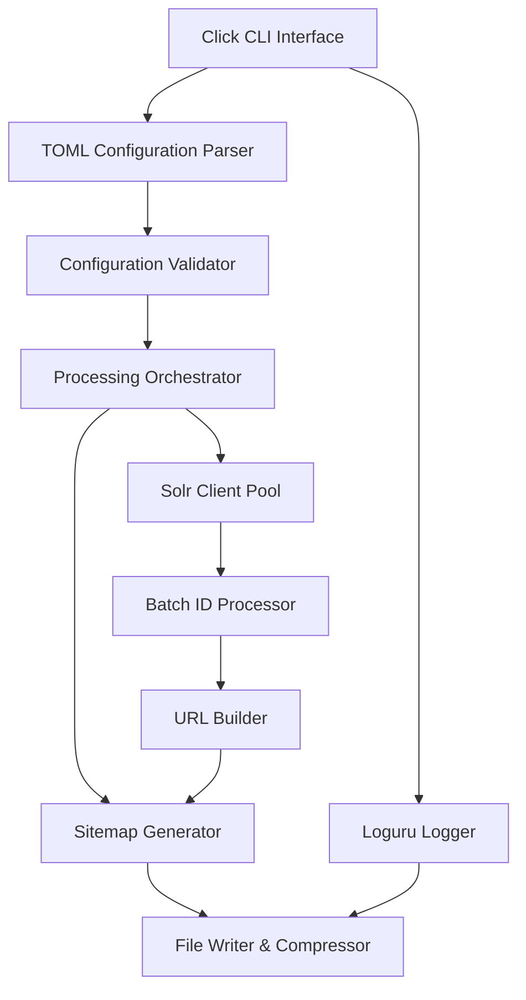

# Design Document

## Overview

The Solr Sitemap Generator is a Python 3.12 CLI application that efficiently extracts document IDs from multiple Solr cores and generates compliant XML sitemaps. The application uses modern Python tooling (uv, loguru, click) and implements parallel processing for handling millions of documents across multiple cores.

## Architecture

### High-Level Architecture



### Core Components

1. **CLI Interface (Click)**: Command-line argument parsing and user interaction
2. **Configuration Management**: TOML parsing and validation
3. **Solr Client**: HTTP client for Solr API interactions with connection pooling
4. **Processing Orchestrator**: Coordinates parallel processing of multiple cores
5. **Batch Processor**: Memory-efficient ID extraction in configurable batches
6. **URL Builder**: Template-based URL generation from document IDs
7. **Sitemap Generator**: XML sitemap creation with splitting and compression
8. **Logging System (Loguru)**: Structured logging with configurable levels

## Components and Interfaces

### CLI Interface (`cli.py`)

```python
@click.command()
@click.option('--config', '-c', default='sitemapper.toml', help='Configuration file path')
@click.option('--output', '-o', help='Output directory (overrides config)')
@click.option('--log-level', default='INFO', help='Logging level')
@click.option('--dry-run', is_flag=True, help='Validate configuration without processing')
def main(config: str, output: Optional[str], log_level: str, dry_run: bool) -> None
```

### Configuration Schema (`config.py`)

```python
@dataclass
class SolrCoreConfig:
    name: str
    url: str
    id_field: str
    date_field: str
    url_pattern: str
    changefreq: str = "weekly"
    batch_size: int = 1000
    timeout: int = 30

@dataclass
class SitemapConfig:
    output_dir: str
    max_urls_per_file: int = 50000
    compress: bool = True
    base_url: str

@dataclass
class AppConfig:
    cores: List[SolrCoreConfig]
    sitemap: SitemapConfig
    parallel_workers: int = 4
    log_level: str = "INFO"
```

### Solr Client (`solr_client.py`)

```python
class SolrClient:
    def __init__(self, base_url: str, timeout: int = 30)
    async def get_total_docs(self, id_field: str) -> int
    async def fetch_docs_batch(self, id_field: str, date_field: str, start: int, rows: int) -> List[SolrDocument]
    async def health_check(self) -> bool

@dataclass
class SolrDocument:
    id: str
    last_modified: Optional[datetime]
```

### Processing Orchestrator (`orchestrator.py`)

```python
class ProcessingOrchestrator:
    def __init__(self, config: AppConfig, logger: Logger)
    async def process_all_cores(self) -> ProcessingResult
    async def process_core(self, core_config: SolrCoreConfig) -> CoreResult
    def _create_progress_tracker(self, total_docs: int) -> ProgressTracker
```

### Batch Processor (`batch_processor.py`)

```python
class BatchProcessor:
    def __init__(self, solr_client: SolrClient, batch_size: int)
    async def extract_all_documents(self, id_field: str, date_field: str, progress_callback: Callable) -> AsyncIterator[List[SolrDocument]]
    def _calculate_optimal_batch_size(self, total_docs: int) -> int
```

### URL Builder (`url_builder.py`)

```python
class URLBuilder:
    def __init__(self, url_pattern: str, base_url: str)
    def build_url(self, document_id: str) -> str
    def validate_pattern(self) -> bool
```

### Sitemap Generator (`sitemap_generator.py`)

```python
class SitemapGenerator:
    def __init__(self, config: SitemapConfig, logger: Logger)
    async def generate_sitemaps(self, sitemap_entries: AsyncIterator[SitemapEntry], core_name: str) -> List[Path]
    def _create_sitemap_xml(self, entries: List[SitemapEntry]) -> str
    def _compress_file(self, file_path: Path) -> Path
    def _create_sitemap_index(self, sitemap_files: List[Path]) -> Path

@dataclass
class SitemapEntry:
    url: str
    last_modified: Optional[datetime]
    changefreq: str
```

## Data Models

### TOML Configuration Structure

```toml
[sitemap]
output_dir = "./sitemaps"
max_urls_per_file = 50000
compress = true
base_url = "https://example.com"

[processing]
parallel_workers = 4
log_level = "INFO"

[[cores]]
name = "main_catalog"
url = "http://solr1:8983/solr/catalog"
id_field = "id"
date_field = "last_indexed"
url_pattern = "https://catalog.example.com/record/{id}"
changefreq = "weekly"
batch_size = 1000
timeout = 30

[[cores]]
name = "archive_catalog"
url = "http://solr2:8983/solr/archive"
id_field = "record_id"
date_field = "modified_date"
url_pattern = "https://archive.example.com/item/{id}"
changefreq = "monthly"
batch_size = 2000
timeout = 45
```

### Processing Result Models

```python
@dataclass
class CoreResult:
    core_name: str
    total_docs: int
    processed_docs: int
    sitemap_files: List[Path]
    processing_time: float
    errors: List[str]

@dataclass
class ProcessingResult:
    core_results: List[CoreResult]
    total_urls: int
    total_files: int
    total_time: float
    success_rate: float
```

## Error Handling

### Error Categories

1. **Configuration Errors**: Invalid TOML, missing required fields, invalid URL patterns
2. **Network Errors**: Solr connection failures, timeouts, HTTP errors
3. **Processing Errors**: Memory issues, file system errors, XML generation failures
4. **Validation Errors**: Invalid document IDs, malformed URLs

### Error Handling Strategy

```python
class SitemapperError(Exception):
    """Base exception for sitemapper errors"""
    pass

class ConfigurationError(SitemapperError):
    """Configuration validation errors"""
    pass

class SolrConnectionError(SitemapperError):
    """Solr connectivity issues"""
    pass

class ProcessingError(SitemapperError):
    """Data processing errors"""
    pass
```

### Resilience Patterns

- **Circuit Breaker**: For Solr connections with automatic retry
- **Graceful Degradation**: Continue processing other cores if one fails
- **Progress Persistence**: Save progress for large datasets to enable resumption
- **Resource Cleanup**: Ensure temporary files are cleaned up on interruption

## Testing Strategy

### Unit Tests

- Configuration parsing and validation
- URL pattern building and validation
- Sitemap XML generation and compression
- Batch processing logic
- Error handling scenarios

### Integration Tests

- Solr client connectivity and data extraction
- End-to-end processing with mock Solr instances
- File system operations and cleanup
- Parallel processing coordination

### Performance Tests

- Memory usage with large datasets (1M+ documents)
- Processing speed benchmarks
- Concurrent Solr core processing
- Sitemap generation and compression performance

### Test Data

- Mock Solr responses with various document counts
- Sample TOML configurations for different scenarios
- Test document ID patterns and URL templates

## Deployment and Packaging

### Python Package Structure

```
sitemapper/
├── pyproject.toml
├── src/
│   └── sitemapper/
│       ├── __init__.py
│       ├── cli.py
│       ├── config.py
│       ├── solr_client.py
│       ├── orchestrator.py
│       ├── batch_processor.py
│       ├── url_builder.py
│       ├── sitemap_generator.py
│       └── exceptions.py
├── tests/
└── README.md
```

### Dependencies (pyproject.toml)

```toml
[project]
name = "sitemapper"
version = "1.0.0"
requires-python = ">=3.12"
dependencies = [
    "click>=8.1.0",
    "loguru>=0.7.0",
    "httpx>=0.25.0",
    "tomli>=2.0.0",
    "lxml>=4.9.0",
]

[project.scripts]
sitemapper = "sitemapper.cli:main"
```

### SystemD Service Configuration

```ini
[Unit]
Description=Solr Sitemap Generator
After=network.target

[Service]
Type=oneshot
User=sitemapper
WorkingDirectory=/opt/sitemapper
ExecStart=/usr/local/bin/uvx sitemapper --config /etc/sitemapper/config.toml
StandardOutput=journal
StandardError=journal

[Install]
WantedBy=multi-user.target
```

### Cron Integration

```bash
# Daily sitemap generation at 2 AM
0 2 * * * /usr/local/bin/uvx sitemapper --config /etc/sitemapper/config.toml
```

## Performance Considerations

### Memory Management

- Stream processing for large datasets to avoid loading all IDs into memory
- Configurable batch sizes based on available memory
- Garbage collection optimization for long-running processes

### Concurrency

- AsyncIO for I/O-bound operations (Solr queries, file writing)
- ThreadPoolExecutor for CPU-bound operations (XML generation, compression)
- Semaphore-based rate limiting for Solr requests

### Scalability

- Horizontal scaling through multiple configuration files
- Vertical scaling through configurable worker counts
- Incremental processing support for very large datasets

## Monitoring and Observability

### Logging Structure (Loguru)

```python
logger.info("Processing started", 
    cores=len(config.cores), 
    output_dir=config.sitemap.output_dir)

logger.debug("Batch processed", 
    core=core_name, 
    batch_size=len(ids), 
    progress=f"{processed}/{total}")

logger.error("Solr connection failed", 
    core_url=core.url, 
    error=str(e), 
    retry_count=retry)
```

### Metrics Collection

- Processing duration per core
- Document extraction rate (docs/second)
- Memory usage peaks
- Error rates and types
- Generated file sizes and counts

### Health Checks

- Solr connectivity validation
- Configuration file validation
- Output directory accessibility
- Disk space availability